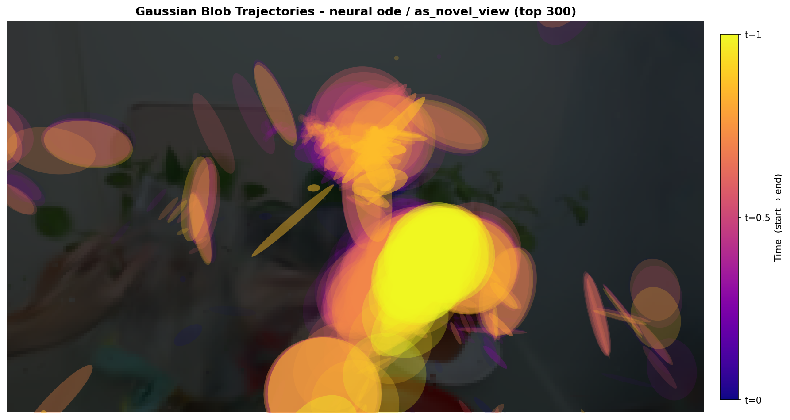
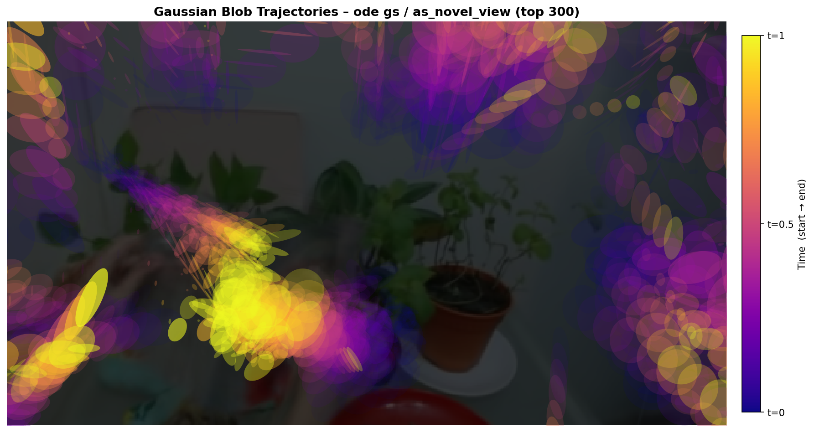

# ExODE-GS: Explicit ODE-Guided Motion Modeling for Dynamic 3D Gaussian Splatting

[Paper](https://github.com/iamkyledang/ExODE-GS) | [Code](https://github.com/iamkyledang/ExODE-GS)

<table>
  <tr>
    <td></td>
    <td></td>
  </tr>
</table>

**Gaussian trajectory comparison on the NeRF-DS `as_novel_view` scene.** The left image is produced from the neural ODE baseline where Gaussian primitives are difficult to trace the change of motion over time. In contrast, ExODE-GS on the right reveals a clearer purple-to-yellow evolution of the Gaussian blobs. This explicit visualization makes it easier to observe how individual primitives move over time in order to analyze the motion of objects in the scene.

---

Reconstructing dynamic 3D scenes requires a motion model that is both expressive and understandable. We propose **ExODE-GS**, an explicit ODE-guided framework in which each Gaussian is assigned a compact set of parameters that defines its continuous-time local motion. This design preserves the efficient rendering pipeline of 3DGS while making the learned dynamics easier to inspect. ExODE-GS is evaluated on HyperNeRF, D-NeRF, and NeRF-DS datasets against deformation-MLP, HexPlane MLP, Fourier temporal basis, and neural ODE baselines.

## Environment

```bash
git clone https://github.com/iamkyledang/ExODE-GS
cd ExODE-GS
git submodule update --init --recursive

conda create -n exode_gs python=3.7
conda activate exode_gs

pip install -r requirements.txt
pip install -e submodules/depth-diff-gaussian-rasterization
pip install -e submodules/simple-knn
```

## Datasets

We evaluate on three benchmarks:

- **D-NeRF** (synthetic) — [download](https://www.albertpumarola.com/research/D-NeRF/index.html)
- **NeRF-DS** (real-world dynamic with specular objects) — [download](https://jokeryan.github.io/projects/nerf-ds/)
- **HyperNeRF** (real-world non-rigid) — [download](https://hypernerf.github.io/)

Organize data as:

```
data/
├── D-NeRF/
│   ├── bouncingballs/
│   ├── lego/
│   └── ...
├── NeRF-DS/
│   ├── as_novel_view/
│   └── ...
└── HyperNeRF/
    ├── interp_chickchicken/
    └── ...
```

## Usage

**Train:**

```bash
# D-NeRF
python train.py -s data/D-NeRF/bouncingballs -m output/bouncingballs --eval --is_blender

# NeRF-DS / HyperNeRF
python train.py -s data/NeRF-DS/as_novel_view -m output/as_novel_view --eval
```

**Render:**

```bash
python render.py -m output/as_novel_view --mode render
```

**Evaluate:**

```bash
python metrics.py -m output/as_novel_view
```
